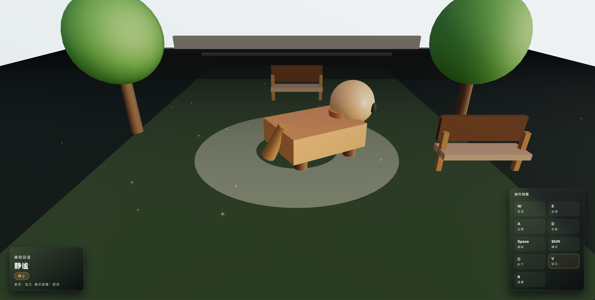

# 水豚噜噜 3D 公园体验

  

> ⚠️ **注意**: 本项目基于 **codex coding agent** 和 **gpt-5.1-codex-mini** 构建，仅用于测试AI编程

本项目采用 React + `@react-three/fiber` + `@react-three/drei` 构建一个可以键盘操控的 3D 水豚角色，呈现带有灯光、粒子、HUD 提示的公园场景，并把所有设计与规划以文档方式沉淀在 `docs/` 目录，可用于后续扩写或演示。



## 核心体验

- 可通过 `W/A/S/D` 移动、`Space` 跳跃、`Shift` 蹲伏、`C`/`V`/`B` 控制趴下/站立/跳舞；
- HUD 实时显示当前动作、姿态与最近按键，配合光效、水面粒子和雾气营造氛围；
- Canvas 全屏展示、Sky/雾与背景几何体塑造“公园”空间感。

## 技术栈

- **Framework**：React 19 + Vite；
- **3D 渲染**：three.js、`@react-three/fiber`、`@react-three/drei`；
- **状态与控制**：自定义的 `useKeyboardControls`、`useCapybaraState` + 简洁 HUD 组件；
- **文档管理**：`planning-with-files` 风格的 `docs/plans` 与 `docs/brainstorming` 目录。

## 快速开始

```bash
# 进入前端项目
cd frontend

# 安装依赖（仅在手动确认后执行）
npm install

# 本地开发
npm run dev

# 生产构建
npm run build
```

## 目录结构概览

- `/frontend/src`：React 入口、Canvas 组件、hook 与 HUD 组件；
- `/frontend/public`：静态资源、图标；
- `/docs/plans`：任务计划、发现、进度、设计、实现计划；
- `/docs/brainstorming`：需求与方案记录；
- `/docs/README.md` & `/docs/AGENTS.md`：文档目录说明与协作准则。

## 运行与测试

- `npm run dev`：启动 Vite 开发服务器，再在浏览器访问默认端口（沙箱里不能直接运行，需用户本地启动）；
- `npm run build`：构建生产包，注意会提示 chunk 大于 500 kB（由 three/drei 体积造成，若需优化可拆分模块或调高 `chunkSizeWarningLimit`）；
- `npm run lint`：校验 ESLint 规则。

## 文档与规划

- `docs/plans/task_plan.md`：记录当前阶段、关键决策与 todo；
- `docs/plans/findings.md`：记录新发现、依赖限制、已知问题；
- `docs/plans/progress.md`：会话日志、测试结果与错误；
- `docs/plans/2026-03-14-capybara-implementation.md`：实施里程碑；
- `docs/brainstorming/需求.md` / `方案.md`：可直接引用需求与方案文字。

## 📄 许可证

MIT License

## 贡献与发布

1. 在 `docs/plans/task_plan.md` 里添加或更新任务后开始编码；
2. 所有变更都应在 `progress.md` 的“Actions taken”中记录，测试结果填表，并在 `findings.md` 写入新的观察或问题；
3. 提交时附上简洁说明、涉及路线图的 README/文档更新，若构建顺利请附上 `npm run build` 输出；若 chunk 警告仍存在，可在 PR 描述中说明接受与否。
